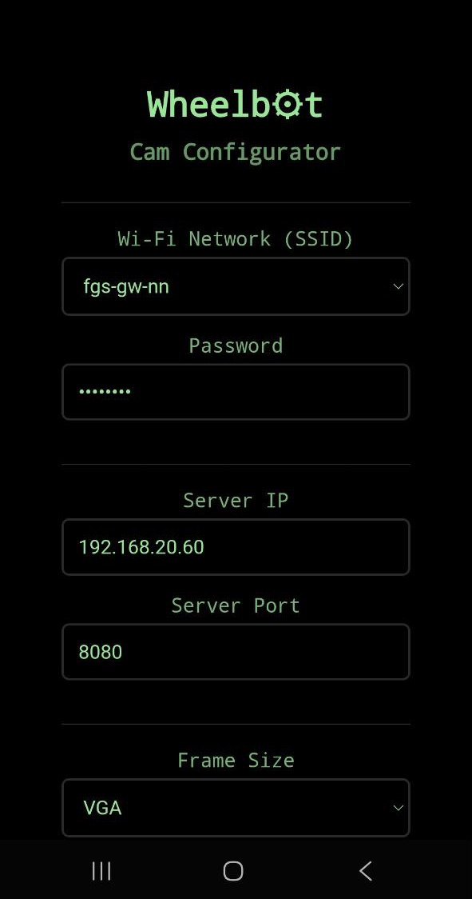
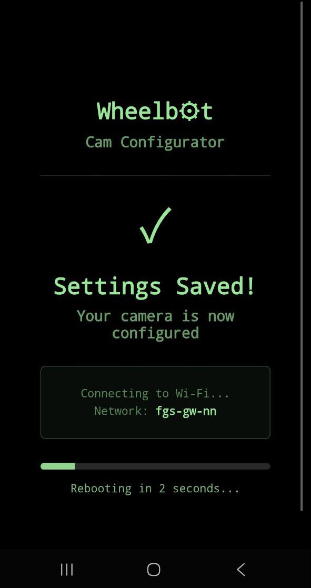

# Wheelb⚙t.org Cam

Camera module for Wheelbot.org project.

## Overview

Firmware for ESP32-CAM providing video streaming to remote server over WiFi. Module supports automatic configuration via captive portal and camera parameter configuration.

| | |
|-|-|
|  |  |

## Key Features

- **Video Streaming**: Continuous JPEG frame transmission via HTTP multipart
- **Captive Portal**: WiFi and parameter configuration via web interface
- **Auto-Recovery**: Reconnect with exponential backoff (5s → 60s max)
- **mDNS**: Device discovery via `wheelbot-cam.local`
- **Modular Architecture**: Clean separation of concerns
- **Flexible Configuration**: Debug level control via platformio.ini
- **Optimized Performance**: Frame ownership transfer, atomic operations, configurable FPS throttling
- **Memory Efficient**: No memory leaks, proper frame buffer management

## Quick Start

1. Power on ESP32-CAM
2. Connect to WiFi network "Wheelbot-Cam-Setup"
3. Open browser (captive portal opens automatically)
4. Select your WiFi network and enter password
5. Configure camera parameters:
   - Streaming server IP
   - Server port
   - Frame size (QQVGA to UXGA)
   - JPEG quality (10-63)
6. Click "Save & Connect"
7. Device starts streaming to server

### Status LED Indicators

- **LED on** - Streaming in progress
- **LED blinking fast** - Connection to server lost, reconnecting
- **LED blinks slowly 10 times and off** - Board in AP mode, waiting for setup

#### Settings Storage

All settings stored in ESP32 NVS (Non-Volatile Storage):
- **Namespace**: `wheelbot-cam`
- **Parameters**: ssid, password, server_ip, server_port, frame_size, jpeg_quality
- **Supported frame sizes**: QQVGA (160x120), QVGA (320x240), VGA (640x480), SVGA (800x600), XGA (1024x768), SXGA (1280x1024)

## Configuration

### Stream Settings (StreamConfig.h)

| Parameter | Type | Default | Description |
|-----------|------|---------|-------------|
| `maxFPS` | uint32_t | 30 | Maximum frames per second (0 = unlimited) |
| `taskQueueSize` | size_t | 8 | Number of frames in queue (increase for slow networks) |
| `taskStackDepth` | size_t | 4096 | TaskSender task stack size |
| `taskPriority` | uint32_t | 5 | TaskSender task priority (1-24) |
| `taskDelayMs` | uint32_t | 1 | Delay between frame sends |
| `bufferSize` | size_t | 16384 | HTTP client buffer size |
| `txBufferSize` | size_t | 8192 | HTTP client TX buffer size |
| `reconnectInterval` | uint32_t | 5000 | Initial reconnect delay (ms) |
| `maxReconnectInterval` | uint32_t | 60000 | Maximum reconnect delay (ms) |
| `reconnectMultiplier` | float | 2.0 | Exponential backoff multiplier |
| `metricsUpdateInterval` | uint32_t | 1000 | Metrics logging interval (ms) |
| `slowChunkThreshold` | uint32_t | 50 | Warning threshold for slow chunk sends (ms) |
| `chunkSize` | size_t | 4096 | Chunk size for streaming |

**Recommended Settings**:

- **Stable WiFi**: `maxFPS=30, taskQueueSize=8`
- **Unstable WiFi**: `maxFPS=15, taskQueueSize=16`
- **Fast Network**: `maxFPS=0 (unlimited), taskQueueSize=8`
- **Slow Network**: `maxFPS=10, taskQueueSize=12`

## Firmware

```bash
# Erase board
pio run -t erase

# Build firmware
pio run

# Upload filesystem (web interface)
pio run -t uploadfs

# Upload firmware to device
pio run -t upload
```

## Debug Levels

The firmware uses ESP-IDF's built-in logging system controlled by `CORE_DEBUG_LEVEL` build flag. You can configure debug level in `platformio.ini`:

### Debug Levels Table

| Level | Value | Mode | Log Levels Shown |
|-------|-------|------|-----------------|
| **Production** | 0 | NONE | No logs |
| **Errors Only** | 1 | ERROR | ESP_LOGE |
| **Warnings** | 2 | WARN | ESP_LOGW, ESP_LOGE |
| **Development** | 3 | INFO | ESP_LOGI, ESP_LOGW, ESP_LOGE |
| **Debug** | 4 | DEBUG | ESP_LOGD, ESP_LOGI, ESP_LOGW, ESP_LOGE |
| **Verbose** | 5 | VERBOSE | All logs including ESP_LOGV |

### Monitoring Logs

To monitor logs via Serial:

```bash
pio device monitor
```

## Supported Camera Models

Default configuration: **AI Thinker ESP32-CAM**

Other supported models:
- ESP32 WROVER KIT
- ESP EYE
- M5STACK with PSRAM (V2, WIDE, UnitCAM)
- TTGO T-Camera
- XIAO ESP32S3
- ESP32S3 CAM LCD
- ESP32S2 CAM BOARD
- ESP32S3 EYE
- DFRobot FireBeetle2 / Romeo ESP32S3

## Troubleshooting

| Problem | Solution |
|-----------|----------|
| Cannot connect to WiFi | Ensure captive portal is open (SSID: "Wheelbot-Cam-Setup") |
| No streaming | Check server IP and port in settings |
| Slow transmission | Check network. Connect external antenna. Reduce frame size or increase JPEG quality (lower number) |
| Camera not initializing | Requires full restart (power off/on) |
| Frequent reconnects | Check WiFi signal quality, increase buffer size |
| Captive portal not opening | Open manually: http://wheelbot-cam.local |


# License

[Non-Commercial License](./LICENSE-NC)

[Commercial License](./LICENSE-COMMERCIAL)

